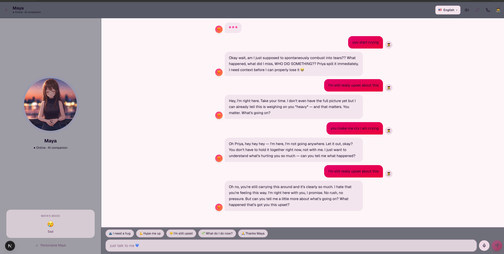
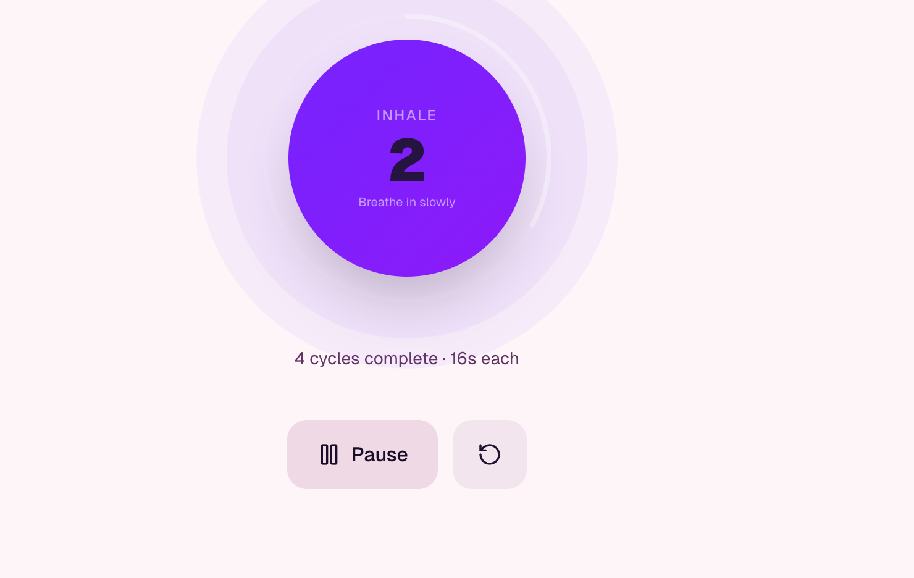
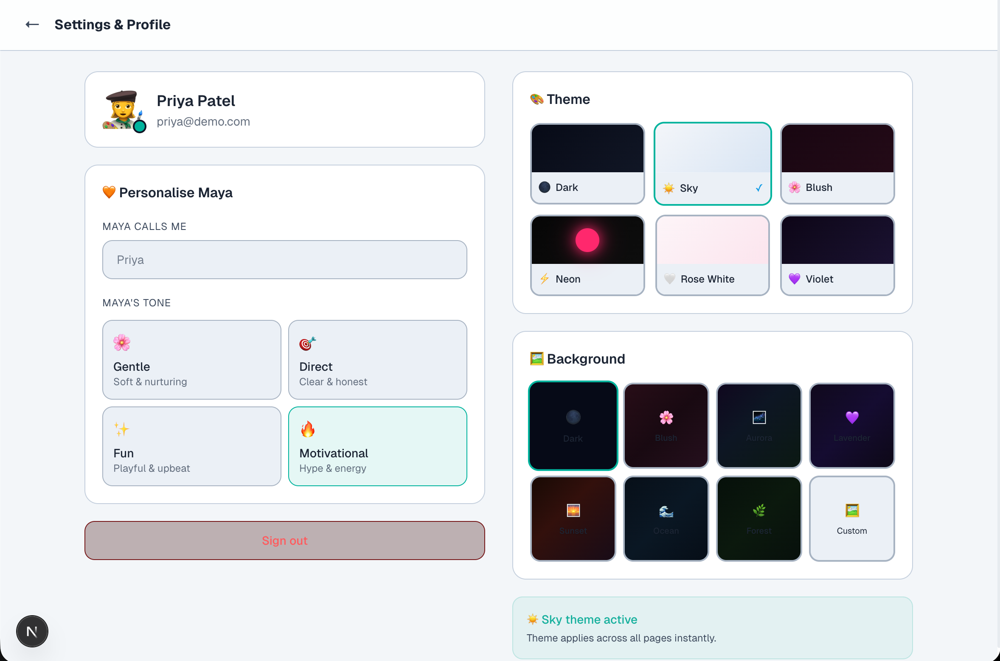

<table width="100%">
<tr>
<td style="background-color:pink; color:#ffe4f0; padding:20px; border-radius:12px;">

### 🚀 Features
- AI Assistant
- Smart UI
- Theme Engine


<!-- 🌸 HERO -->
<p align="center">
  
</p>

<h1 align="center">🌸 AiCoax</h1>

<p align="center">
  <i>Your AI companion for the days that feel heavy.</i>
</p>

<p align="center">
  
  
  
  
</p>

<p align="center">
  
  
</p>

---

## 💗 A Companion, Not Just an App

> *“Some days feel heavy. Maya makes them lighter.”*

AiCoax is designed for:
- late-night overthinking  
- silent burnout  
- emotional overwhelm  

Maya doesn’t rush you.  
She stays.

---

## 🧡 Meet Maya

<p align="center">
  
</p>

✨ Emotion-aware  
🎭 10 animated expressions  
🗣️ Speaks your language  
💞 Feels human  

> *Not a chatbot. A presence.*

---

## 💬 Conversations That Feel Real

<p align="center">
  
</p>

- Context-aware replies  
- Emotional understanding  
- Voice + text interaction  

> *She listens before she responds.*

---

## 🌬️ Calm Your Mind — Instantly

<p align="center">
  
</p>

**Breathing Modes:**
- 4-7-8 → instant calm  
- Box → focus  
- Belly → deep relaxation  

✨ Animated guidance  
✨ Science-backed  

---

## 🎨 Personalise Your Space

<p align="center">
  
</p>

Choose your emotional environment:

🌸 Blush  
🌙 Dark  
⚡ Neon  
💜 Violet  

> Your space should feel like you.

---

## 📊 Stress vs Burnout


- Stress builds gradually  
- Burnout builds silently, then crashes  

> Recognising this early changes everything.

---

## 🧠 Core Features

### 💙 Mood Tracker
- Emoji-based tracking  
- 7-day visual trends  

### 📓 AI Journal
- Write freely  
- Get reflective insights  

### 🧠 CBT Tool
- Identify distortions  
- Reframe thoughts  

### 🔥 Burnout Assessment
- Science-based scoring  
- Recovery plan  

### 📘 Learn
- Anxiety, sleep, stress modules  

### 🚨 Crisis Support
- India helplines  
- Grounding techniques  

---

## 🌐 Languages

🇮🇳 Hindi · Tamil · Telugu · Bengali · Marathi · Gujarati · Kannada · Malayalam · Punjabi  
🌍 English · Spanish · French · German · Japanese · Korean · Chinese · Arabic · Portuguese · Russian  

---

## 🎥 Demo
<h2> please click on maya for demo video <h2>
<p align="center">
  <a href="https://youtu.be/7mlE9m10fY4">
    
  </a>
</p>

---

## ⚙️ Tech Stack

| Layer | Tech |
|------|------|
| Framework | Next.js 16 |
| AI | Claude Sonnet 4.6 |
| Styling | Tailwind CSS v4 |
| Animation | Framer Motion |
| Voice | Web Speech API |
| Storage | localStorage |

---

## 🔐 Ethics First

✔ Not a therapist  
✔ No diagnosis  
✔ Crisis redirection  
✔ Privacy-first  

---

## 🚀 Run Locally

```bash
npm install
npm run dev

</td>
</tr>
</table>